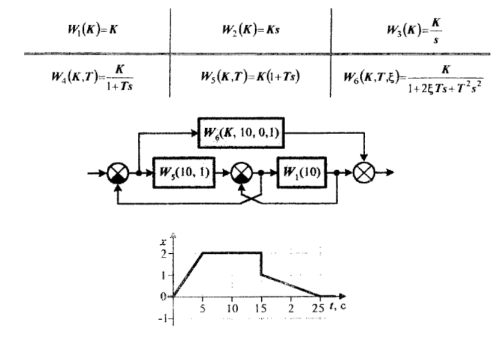

# Домашнее задание

## Проанализировать систему автоматического управления.
### Варинат 9

### Исходные данные

### Задание
1. Построить ЛАХ и ФЧХ
2. Задать коэффициент таким, чтобы система была устойчивой (подобрать руками)
3. Найти ПФ замкнутой системы, с единичной ОС
4. Преобразовать ПФ в форму дифференциальных уравнений
5. Построить переходной процесс
6. Завести функцию IV из Мизрахички, проверить что она работает на сигнале err
7. Обернуть расчёт переходного процесса и итегрального критерия в одну функцию (targetFun)
8. Вызвать для нее оптимизатор (minimize) по своему коэффициенту, он подберёт максимально качественный переходной процесс.
